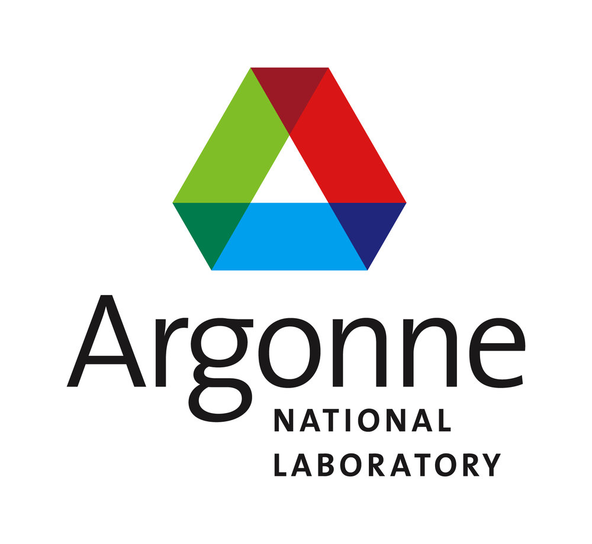
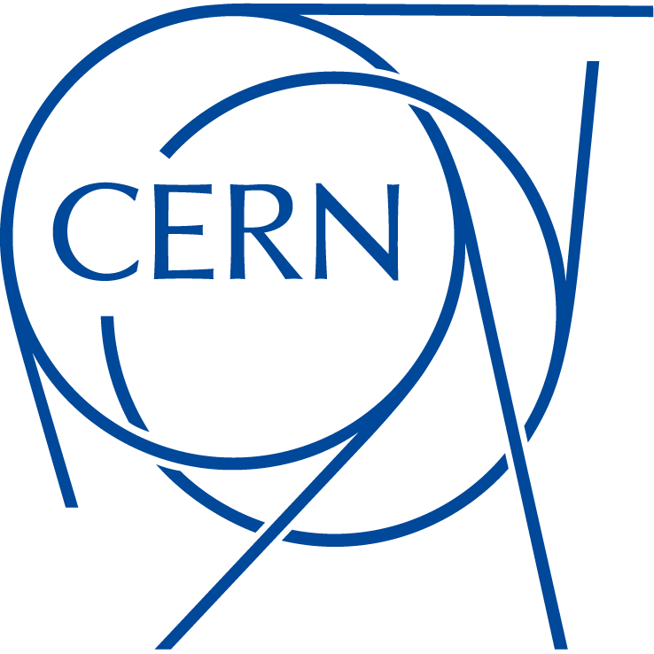
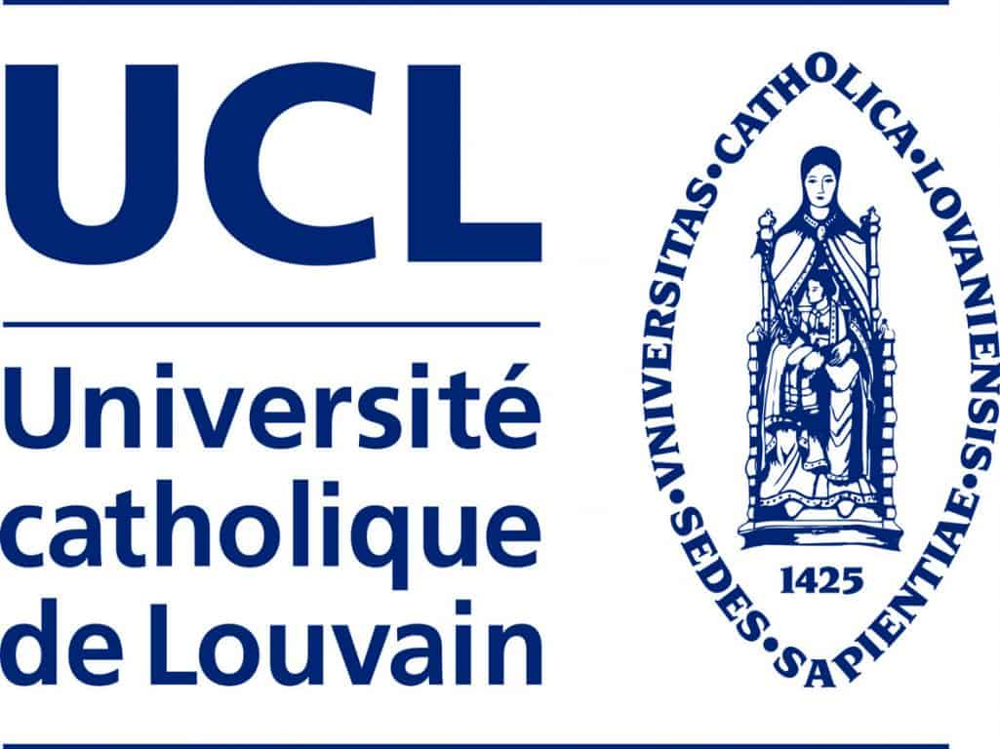

This web page contains information about a software engineering effort to port the <a href="https://launchpad.net/mg5amcnlo" target="_blank">Madgraph5_aMC@NLO</a> Monte Carlo event generator onto GPUs. The main development goals are

- Execution of physics event processes on GPU architectures
- Optimisation of the existing CPU implementation (inspired by GPU developments) 
- Heterogeneous execution on CPU and GPU architectures
- Implementations in various GPU programming languages and hardware abstraction layers
- Merge developments into the upstream Madgraph5_aMC@NLO code generator 

The development team of this effort comprises students, faculty and researchers at various institutes and universities (see also <a href="https://github.com/orgs/madgraph5/people" target="_blank">Development Team</a>)

- Argonne National Lab (US)
- CERN (CH)
- PES University (IN)
- University Catholique de Louvain (BE)
- University of Sussex (UK)

 <table style="width:100%" class="center">
  <tr>
    <td></td>
    <td></td>
    <td></td>
    <td></td>
    <td></td>
  </tr>
</table> 
